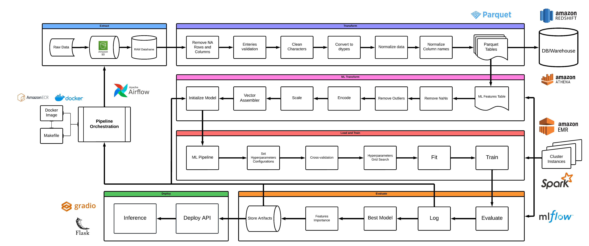
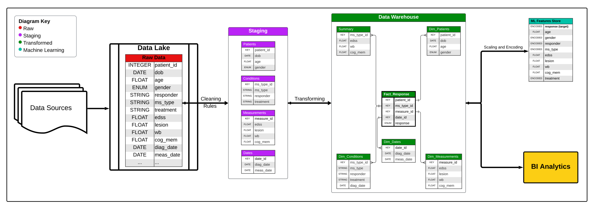

# Multiple Sclerosis (MS) Prediction Pipeline

## Project Overview

This framework demonstrates an end-to-end machine learning pipeline for predicting Multiple Sclerosis (MS) treatment response. The project utilizes patient data from Hadassah Ein Karem Hospital in Jerusalem to build predictive models that can assist healthcare professionals in making informed decisions about MS treatment.

## What is Multiple Sclerosis (MS)?

Multiple Sclerosis is a chronic autoimmune disease that affects the central nervous system. It causes the immune system to attack the protective covering of nerve fibers (myelin), leading to communication problems between the brain and the rest of the body. MS can cause a wide range of symptoms, including fatigue, difficulty walking, vision problems, and cognitive issues.

## Data Description

The dataset used in this project contains anonymized patient information from Hadassah Ein Karem Hospital in Jerusalem. It includes the following features:

- Demographic information (age, gender)
- MS type (Relapsing-Remitting, Secondary Progressive, Primary Progressive)
- Current treatment
- MRI data (Lesion, WB)
- EDSS (1-8)
- Treatment response (yes/no) (Target)

---

## MS Prediction Pipeline: ML Engineering and MLOps Framework
This project exemplifies a comprehensive ML engineering and MLOps framework, incorporating best practices for developing, deploying, and maintaining machine learning models at scale. 

<table>
  <tr>
    <td>
      <table>
        
      </table>
    </td>
    <td>
      <table>
        
      </table>
    </td>
    <td>
      <table>
        
      </table>
    </td>
  </tr>
</table>

#### 1. Data Engineering

Data Extraction: Utilizes Amazon S3 for raw data storage, demonstrating cloud-based data management.
Data Transformation: Implements robust data cleaning, normalization, and feature engineering using Apache Spark, showcasing big data processing capabilities.

#### 2. Feature Engineering

ML Data Preparation: Applies advanced feature selection, encoding, and scaling techniques, crucial for model performance.
Stores processed data in Parquet format, optimizing for ML workflows.

#### 3. Model Development

Leverages MLflow for experiment tracking, enabling reproducibility and version control.
Implements multiple model architectures (Decision Trees, Random Forests, Gradient Boosting) to compare performance.
Utilizes cross-validation and hyperparameter tuning for robust model selection.

#### 4. Model Deployment

Model Serving:

Deploys models via Flask APIs, allowing for scalable and manageable serving infrastructure.
Implements Gradio for interactive web interfaces, enhancing model interpretability and user engagement.

#### 5. MLOps Practices

Pipeline Orchestration:

Uses Apache Airflow for end-to-end pipeline automation, crucial for production ML workflows.
Enables scheduled retraining, ensuring models stay up-to-date with new data.

Containerization:

Dockerfile inclusion supports containerized deployment, ensuring consistency across environments.

Version Control:

Structured project layout facilitates collaborative development and version control.

#### 6. Scalability and Cloud Integration

Utilizes Amazon EMR and Redshift, demonstrating cloud-native architecture for scalable ML operations.

#### 7. Continuous Integration/Continuous Deployment (CI/CD)

The project structure and use of Airflow set the stage for implementing CI/CD pipelines for model updates.

This framework addresses the full lifecycle of ML projects, from data preparation to model deployment and maintenance, aligning closely with industry-standard ML engineering and MLOps practices. It provides a robust foundation for scalable, reproducible, and maintainable machine learning solutions in a healthcare context.

## Pipeline Steps

1. **Data Extraction**: 
   - Load raw data from S3 storage
   - Store in temporary database for processing

2. **Data Transformation**:
   - Remove NA rows and columns
   - Validate data entries
   - Clean and standardize data
   - Convert data types
   - Normalize data
   - Save transformed data as Parquet files

3. **ML Data Preparation**:
   - Remove outliers
   - Encode categorical variables
   - Scale numerical features
   - Select relevant features for model training

4. **Model Training and Evaluation**:
   - Set up MLflow for experiment tracking
   - Train multiple models (Decision Trees, Random Forests, Gradient Boosting)
   - Perform hyperparameter tuning
   - Evaluate models using cross-validation
   - Log metrics, parameters, and artifacts to MLflow

5. **Model Deployment**:
   - Select best performing models
   - Create Flask APIs for model serving
   - Deploy models using Gradio for interactive web interfaces

6. **Pipeline Orchestration**:
   - Use Apache Airflow to orchestrate the entire pipeline
   - Schedule regular model retraining and deployment

## Technology Stack

- **Data Storage**: Amazon S3, Amazon Redshift, Parquet
- **Clustering**: Amazon EMR
- **Data Processing**: Apache Spark, Pandas
- **ML Framework**: MLflow
- **Model Serving**: Flask, Gradio
- **Pipeline Orchestration**: Apache Airflow
- **Containerization**: Docker, Amazon ECR

